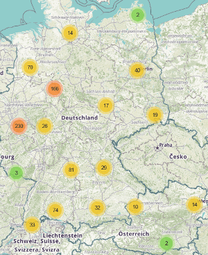



[README in English](./README.md)

# [kirchen-im-web.de](https://kirchen-im-web.de/de/) - Verzeichnis kirchlicher Web- und Social-Media-Auftritte

Wir wollen zeigen, dass viele Kirchengemeinden, Landeskirchen und Bistümer auch im Web 
    gute Öffentlichtkeitsarbeit machen und stellen diese mit ihren Web- und Social-Media-Auftritten 
    [in einer Karte](https://kirchen-im-web.de/de/karte/) und 
    [tabellarisch](https://kirchen-im-web.de/de/suche/) dar.
kirchen-im-web.de vergleicht auch die Follower-Zahlen der
    [Social-Media-Auftritte](https://kirchen-im-web.de/de/vergleich/).

Unser Projekt ist überkonfessionell, d. h. egal ob evangelisch, katholisch oder freikirchlich - alle können mitmachen. 
Sie können Ihre Gemeinde einfach über unser 
    [Formular](https://kirchen-im-web.de/de/eintragen/) hinzufügen.

## Funktionen
* [Karte](https://kirchen-im-web.de/de/karte/)
    mit allen Gemeinden, die nach Konfession und Netzwerk gefiltert werden kann
* [Tabelle](https://kirchen-im-web.de/de/suche/) und [Social-Media-Vergleich](https://kirchen-im-web.de/de/vergleich/)
    mit Filter nach Name, PLZ, Stadt, Land, Konfession, Gemeindetyp, Netzwerk
* [Detailseite](https://kirchen-im-web.de/de/details/1/)
    für jede Gemeinde, die alle Web- und Social-Media-Auftritte, eine Karte und die Hierarchie anzeigt
    sowie die Follower-Historie der Social-Media-Auftritte zum Download anbietet
* Formular zum [Hinzufügen neuer Gemeinden](https://kirchen-im-web.de/de/eintragen/)
* [Statistik](https://kirchen-im-web.de/de/statistik/)
    und herunterladbare [offene Daten](https://kirchen-im-web.de/de/daten/)
* verfügbar in Deutsch und Englisch
