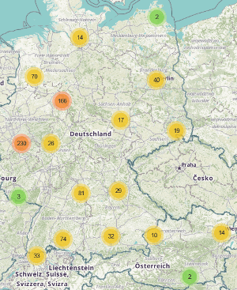

# [kirchen-im-web.de](https://kirchen-im-web.de/en/) - Directory of Churchy Websites and Social Network Pages 

We want to show that many parishes, regional churches and dioceses
    do a good job in public relations 
    and present those with their websites and social network pages 
    [at a map](https://kirchen-im-web.de/en/map/) and 
    [tabularly](https://kirchen-im-web.de/en/search/).
kirchen-im-web.de also compares the follower numbers of the
    [social media pages](https://kirchen-im-web.de/en/comparison/).

Our Project is oecumenic, i. e. regardless whether Protestants, Catholic or free church - all can participate.
You can simply add your church using our [form](https://kirchen-im-web.de/en/add/).

The latest development version is online at [test.kirchen-im-web.de](https://test.kirchen-im-web.de/en/).

## Features
* [map](https://kirchen-im-web.de/en/map/)
    with all churches which can be filtered according to denomination and network
* [table](https://kirchen-im-web.de/en/search/)
    with filtering according to name, postal code, city, country, denomination, type, network
* [details page](https://kirchen-im-web.de/en/details/1/)
    for every church showing all websites and networks, map and church hierarchy
* form to [add new churches](https://kirchen-im-web.de/en/add/)
* [statistics](https://kirchen-im-web.de/en/statistics/)
    and downloadable [open data](https://kirchen-im-web.de/en/data/)
* available in English and German

## API Documentation

kirchen-im-web.de offers the data via a public API at `https://kirchen-im-web.de/api/` which returns all the data on the selected churches in JSON format. Even if there is only one result for the query, the data is returned as a list.

### GET /api/churches/

Per default, the whole data is returned in [JSON](https://www.json.org/).
Parameters can be used to reduce the number of entries which are returned.

Example: A call to `https://kirchen-im-web.de/api/churches/?name=test` only returns data of the churches whose name contains the string `test`.

Supported parameters:

* `ids` (optional):
    entry ids (multiple ids can be separated by comma)
* `parent` (optional):
    only children of the given parent id
    (`options` allow to include the parent itself and grandchildren)
* `name` (optional):
    the substring of the name
* `postalCode` (optional):
    the postal code
* `city` (optional):
    the substring of the city
* `country` (optional):
    the country code (e. g. `DE` for Germany).
	Possible values: see `$countries` variable in the [configuration file](./src/Helpers/Configuration.php)
* `denomination` (optional):
    the denomination.
	Possible values: see `$denominations` variable in the configuration file
* `type` (optional):
    the type.
	Possible values: see `$types` variable in the configuration file
* `hasWebsiteType` (optional):
    the website type.
	Possible values: see `$websites` variable in the configuration file
* `options=includeSelf,recursive` (optional):
    * If `parent` is given and `options` contains `childrenRecursive`,
        the grandchildren are also included in the response.
    * If `parent` is given and `options` contains `includeSelf`,
        the parent is included in the response.

### GET /api/churches/{id}/
The data of the church with the given id is returned in JSON.
The entry id is the number in the URL of the details page.

### GET /api/churches/{id}/children/
Returns the (direct) children of the church with the given id in JSON.

## How to develop

### Requirements
* [Apache](https://httpd.apache.org/) 2.4+
* [PHP](https://secure.php.net/) 7+
* [MySQL](https://dev.mysql.com/downloads/) database
* [Node.js](https://nodejs.org/en/download/) 10+
    and [npm](https://www.npmjs.com/) 6+
* [Composer](https://getcomposer.org/) 1.7+

### Setup
* Clone the Git repository.
* Install the dependencies via `composer install`
    (this includes `npm install` for Bootstrap and JavaScript libraries).
* Run `composer dev` to automatically compile `*.scss` to `*.css` 
    and `*.js` to `*.min.js` whenever the file is changed.
* Create a database and create the tables with `database-scheme.sql`.
* Create a `config.php` with the database credentials and valid API keys/secrets
    (cp. `config.sample.php`).

### Code Style Guidelines
- CSS: recommended configuration for [stylelint](https://stylelint.io/)
    - `npm run csCSS` to run a check for compliance with the guidelines
    - `npm run fixCSS` applies fixes for violations automatically.
- JavaScript: [JavaScript Standard Style](https://standardjs.com/rules.html),
    checked by [eslint](https://eslint.org/)
    - `npm run csJS` to run a check for compliance with the guidelines
    - `npm run fixJS` applies fixes for violations automatically.
- PHP: [PSR2](https://www.php-fig.org/psr/psr-2/)
    - `composer csPHP` to run a check for compliance with the guidelines
    - `composer fixPHP` applies fixes for violations automatically.

To run all checks, use `composer cs`.

## Used programming languages and libraries
* [HTML5 and CSS 3.0](https://www.w3.org/standards/webdesign/htmlcss), based on
    [Bootstrap 4](https://getbootstrap.com/)
* [PHP](https://secure.php.net/) with libraries
    [Slim](https://www.slimframework.com/), 
    [Twig](https://twig.symfony.com/),
    [instagram-php-scraper](https://github.com/postaddictme/instagram-php-scraper)
    and [twitter-api-php](https://github.com/J7mbo/twitter-api-php)
* JavaScript, especially the libraries 
    [jQuery](https://jquery.com/),
    [Highcharts](https://www.highcharts.com/),
    [Leaflet](https://leafletjs.com/) and 
    [Tablesorter](https://mottie.github.io/tablesorter/)

## How to deploy
- Run `composer prod`.
- Upload the following to the production server: 
    - the directories `assets`, `images`, `lang`, `src`, 
        `theme` and `vendor`
    - the files `.htacess`, `*.png`, `browserconfig.xml`, `favicon.ico`
        `config.php`, `cron.php`, `index.php` and `manifest.json`.
- Create empty directories `cache` and `data`.

# [kirchen-im-web.de](https://kirchen-im-web.de/de/) - Verzeichnis kirchlicher Web- und Social-Media-Auftritte

Wir wollen zeigen, dass viele Kirchengemeinden, Landeskirchen und Bistümer auch im Web 
    gute Öffentlichtkeitsarbeit machen und stellen diese mit ihren Web- und Social-Media-Auftritten 
    [in einer Karte](https://kirchen-im-web.de/de/karte/) und 
    [tabellarisch](https://kirchen-im-web.de/de/suche/) dar.
kirchen-im-web.de vergleicht auch die Follower-Zahlen der
    [Social-Media-Auftritte](https://kirchen-im-web.de/de/vergleich/).

Unser Projekt ist überkonfessionell, d. h. egal ob evangelisch, katholisch oder freikirchlich - alle können mitmachen. 
Sie können Ihre Gemeinde einfach über unser 
    [Formular](https://kirchen-im-web.de/de/eintragen/) hinzufügen.

Die aktuelle Entwicklungsversion gibt es unter 
    [test.kirchen-im-web.de](https://test.kirchen-im-web.de/de/).

## Funktionen
* [Karte](https://kirchen-im-web.de/de/karte/)
    mit allen Gemeinden, die nach Konfession und Netzwerk gefiltert werden kann
* [Tabelle](https://kirchen-im-web.de/de/suche/)
    mit Filter nach Name, PLZ, Stadt, Land, Konfession, Gemeindetyp, Netzwerk
* [Detailseite](https://kirchen-im-web.de/de/details/1/)
    für jede Gemeinde, die alle Web- und Social-Media-Auftritte, eine Karte und die Hierarchie anzeigt
* Formular zum [Hinzufügen neuer Gemeinden](https://kirchen-im-web.de/de/eintragen/)
* [Statistik](https://kirchen-im-web.de/de/statistik/)
    und herunterladbare [offene Daten](https://kirchen-im-web.de/de/daten/)
* verfügbar in Deutsch und Englisch
